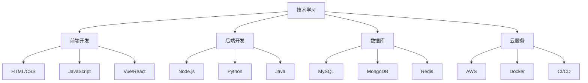

# 技术笔记

这里记录我在技术学习和实践过程中的笔记和总结。

## 技术分类

### Web 开发
- **前端技术** - HTML、CSS、JavaScript 及框架
- **后端开发** - 服务器端技术和API设计
- **全栈开发** - 前后端整合和部署

### 数据库技术
- **关系型数据库** - MySQL、PostgreSQL
- **NoSQL 数据库** - MongoDB、Redis
- **数据库设计** - 数据建模和优化

### 云服务与部署
- **云平台** - AWS、阿里云、腾讯云
- **容器技术** - Docker、Kubernetes
- **CI/CD** - 持续集成和部署

## 学习方法

::: tip 技术学习建议
1. **理论结合实践** - 学习概念后立即动手实验
2. **搭建测试环境** - 在本地环境中验证技术方案
3. **记录问题解决** - 详细记录问题和解决过程
4. **关注技术趋势** - 跟踪新技术发展动态
:::

## 内容规划

| 主题 | 描述 | 状态 |
|------|------|------|
| [Web 开发](./web-development) | 前后端开发技术总结 | 📝 计划中 |
| [数据库](./database) | 数据库设计和优化 | 📝 计划中 |
| [云服务](./cloud-services) | 云平台使用经验 | 📝 计划中 |

## 技术栈概览

---

*最后更新: 2025年6月*
