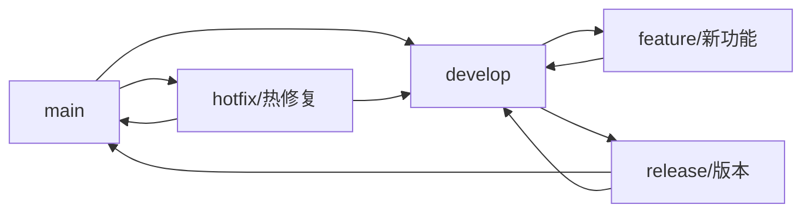

# Git 使用指南

Git 是现代软件开发中不可或缺的版本控制工具。本指南涵盖了从基础到进阶的 Git 使用方法。

## Git 基础概念

### 工作区域
- **工作目录 (Working Directory)** - 当前正在工作的目录
- **暂存区 (Staging Area)** - 准备提交的文件区域
- **本地仓库 (Repository)** - Git 存储版本信息的地方

### 文件状态
- **未跟踪 (Untracked)** - 新文件，Git 不知道它的存在
- **已跟踪 (Tracked)** - Git 已知的文件
  - **未修改 (Unmodified)** - 文件没有变化
  - **已修改 (Modified)** - 文件有变化但未暂存
  - **已暂存 (Staged)** - 文件已暂存等待提交

## 常用命令

### 基础操作

```bash
# 初始化仓库
git init

# 克隆远程仓库
git clone https://github.com/username/repository.git

# 查看状态
git status

# 查看详细变化
git diff
```

### 文件操作

```bash
# 添加文件到暂存区
git add filename.txt        # 添加单个文件
git add .                   # 添加所有文件
git add *.js               # 添加所有 JS 文件

# 提交更改
git commit -m "提交信息"

# 添加并提交（已跟踪文件）
git commit -am "提交信息"
```

### 分支操作

```bash
# 查看分支
git branch                  # 本地分支
git branch -r              # 远程分支
git branch -a              # 所有分支

# 创建分支
git branch feature-branch

# 切换分支
git checkout feature-branch

# 创建并切换分支
git checkout -b feature-branch

# 合并分支
git checkout main
git merge feature-branch

# 删除分支
git branch -d feature-branch
```

### 远程操作

```bash
# 查看远程仓库
git remote -v

# 添加远程仓库
git remote add origin https://github.com/username/repo.git

# 推送到远程
git push origin main

# 从远程拉取
git pull origin main

# 获取远程更新（不合并）
git fetch origin
```

## 进阶用法

### 撤销操作

```bash
# 撤销工作目录的修改
git checkout -- filename.txt

# 撤销暂存
git reset HEAD filename.txt

# 撤销最近的提交（保留修改）
git reset --soft HEAD~1

# 撤销最近的提交（丢弃修改）
git reset --hard HEAD~1
```

### 查看历史

```bash
# 查看提交历史
git log

# 简洁格式
git log --oneline

# 图形化显示
git log --graph --oneline

# 查看某个文件的历史
git log -p filename.txt
```

### 标签管理

```bash
# 创建标签
git tag v1.0.0

# 创建带注释的标签
git tag -a v1.0.0 -m "版本 1.0.0"

# 推送标签
git push origin v1.0.0

# 推送所有标签
git push origin --tags
```

## 工作流程

### Git Flow 工作流



### 基本工作流程

1. **创建功能分支**
   ```bash
   git checkout -b feature/user-login
   ```

2. **开发功能**
   ```bash
   # 修改代码
   git add .
   git commit -m "添加用户登录功能"
   ```

3. **推送分支**
   ```bash
   git push origin feature/user-login
   ```

4. **创建 Pull Request/Merge Request**

5. **合并到主分支**
   ```bash
   git checkout main
   git pull origin main
   git merge feature/user-login
   git push origin main
   ```

## 配置优化

### 全局配置

```bash
# 用户信息
git config --global user.name "你的姓名"
git config --global user.email "your.email@example.com"

# 默认编辑器
git config --global core.editor "code --wait"

# 颜色输出
git config --global color.ui auto

# 默认分支名
git config --global init.defaultBranch main
```

### 有用的别名

```bash
git config --global alias.st status
git config --global alias.co checkout
git config --global alias.br branch
git config --global alias.cm commit
git config --global alias.lg "log --oneline --graph --all"
git config --global alias.unstage "reset HEAD --"
```

## 常见问题解决

### 解决冲突

```bash
# 当合并出现冲突时
git status                 # 查看冲突文件
# 手动编辑冲突文件，解决冲突
git add .                  # 标记冲突已解决
git commit                 # 完成合并
```

### 忽略文件

创建 `.gitignore` 文件：

```gitignore
# 依赖目录
node_modules/
vendor/

# 构建输出
dist/
build/
*.min.js
*.min.css

# 环境配置
.env
.env.local
.env.production

# 编辑器配置
.vscode/
.idea/
*.swp
*.swo

# 系统文件
.DS_Store
Thumbs.db

# 日志文件
*.log
logs/
```

## 最佳实践

::: tip 提交信息规范
使用清晰的提交信息格式：
- `feat: 添加新功能`
- `fix: 修复bug`
- `docs: 更新文档`
- `style: 代码格式调整`
- `refactor: 代码重构`
- `test: 添加测试`
:::

::: warning 注意事项
1. **频繁提交** - 小步快跑，经常提交
2. **有意义的提交信息** - 让别人知道你做了什么
3. **分支管理** - 为不同功能创建不同分支
4. **定期推送** - 避免本地代码丢失
:::

## 学习资源

- [Git 官方文档](https://git-scm.com/doc)
- [Pro Git 书籍](https://git-scm.com/book/zh/v2)
- [Learn Git Branching](https://learngitbranching.js.org/?locale=zh_CN)
- [Git 简明指南](https://rogerdudler.github.io/git-guide/index.zh.html)

---

*最后更新: 2025年6月*
